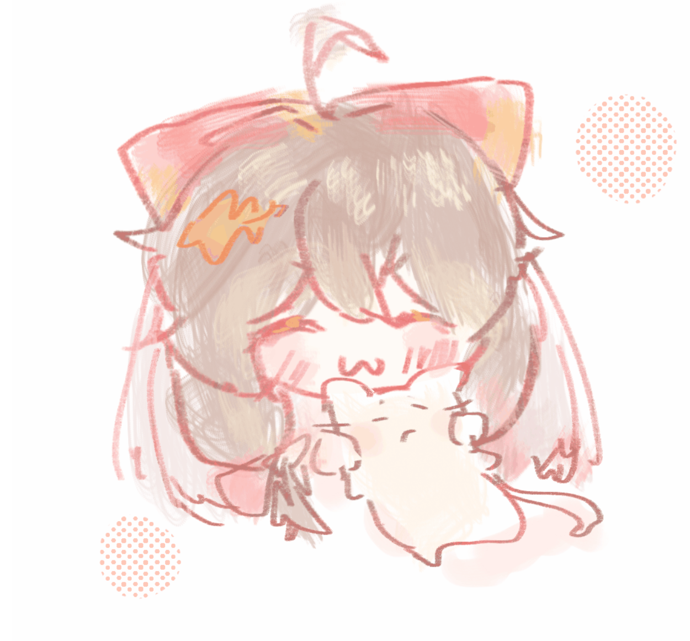
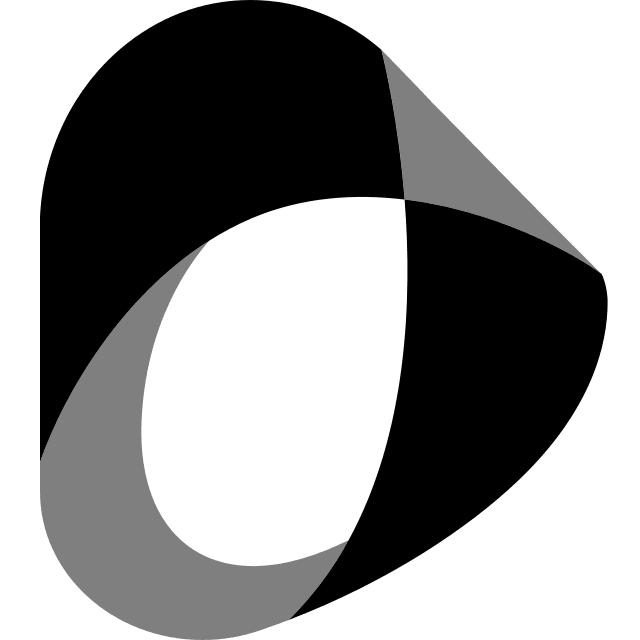
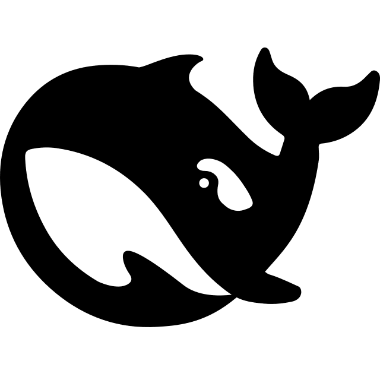

## About Me

Hi! I'm Dianashiba. 

Graduated from NJUST(2022 - 2026)

Currently a master student at FDU

CTF player at [C.A.T](https://cat-team.online/)

[Email](mailto:avad1anash1ba@gmail.com) / [GitHub](https://github.com/Dianashiba)

 
 

## Publications & Projects

<!-- * **Project Name** — Short description of this project. [\[link\]](https://github.com/Dianashiba)

* **Another Project** — Brief introduction of what this is about. [\[link\]](https://github.com/Dianashiba) -->

 
 

## Misc

<!-- Some other things you'd like to share — hobbies, photos, etc. -->

## Friends

 

**Claude**  
Anthropic's AI assistant

 

**ChatGPT**  
OpenAI's conversational AI

 

**豆包**  
ByteDance's AI assistant

 

**DeepSeek**  
Open-source reasoning model

 
 

<strong>Maybe not today. Maybe not tomorrow. But one day ;D</strong>

